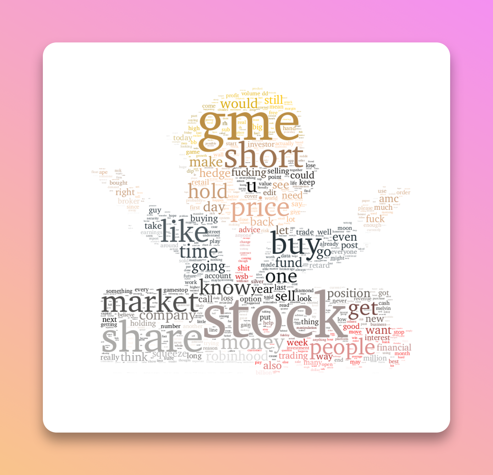

# WallStreetBets posts analysis  
> An analysis about WallStreetBets Subreddit Posts

This projet is an attemp to NLP on WallStreeBetss Posts and comments during the period of euphoria about GameStop.

## The data

The data are scrapped data from reddit.

## Analysis

The jupyter notebook **[WSB_Content_Analysis](https://nbviewer.org/github/npogeant/amzn2019/blob/main/Main_Analysis_AMZN.ipynb)** in the repository is the analysis mixing topic modeling and word frequency (+ bi-grams).

This is an example of the Visualization I got :

  

I also wrote an **[article](https://medium.com/analytics-vidhya/whats-inside-wallstreetbets-posts-topic-modeling-and-bi-grams-d00352082e552)** on medium about the analysis I did with the results I got.